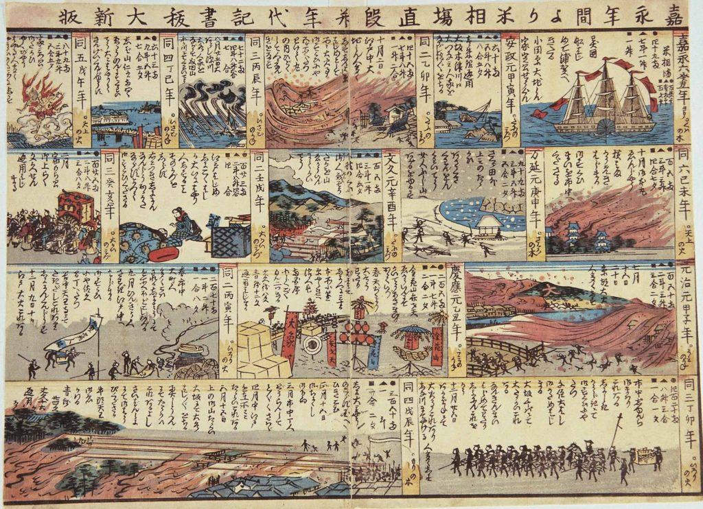
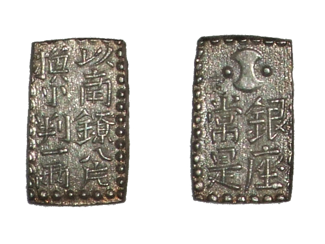

### Keywords

* isolationism, opening up, [arbitrage](https://en.wikipedia.org/wiki/Arbitrage), [Gresham's Law](https://en.wikipedia.org/wiki/Gresham%27s_law).

### A Timeline of Events

* see [here](https://github.com/michaelschiltz/Japanese_History_2/blob/master/related%20docs/session_1_timeline.pdf)

### Points of discussion

* a critical text examination: list the characteristics of Matsukata's report; who is his audience? what does he try to accomplish? how does all this affect out interpretation of his text?
* why could the pre-modern monetary system continue for so long? List the conditions for this; who or what was to gain from this set-up?
* why is it important to know that silver and gold were not mere commodities, but the country's currency as well?
* try to explain how Japan's adoption of the gold standard as a monetary standard is not a neutral event, but reflects the norms associated with a Great-Britain led world-order.
* do you see parallels with other past and/or contemporary happenings?
* **The [Kanagawa Treaty](https://en.wikipedia.org/wiki/Convention_of_Kanagawa) and the [Harris Treaty](https://en.wikipedia.org/wiki/Treaty_of_Amity_and_Commerce_(United_States%E2%80%93Japan)) (together with appendices) can be found in full-text version online (Wikisource contains only parts of the text): make sure to read these originals and point out the relevant articles. Students with a sufficient level of Japanese are strongly invited to consult the Japanese originals on the Wikipedia-pages (including ウィキソース), the [Diet Library](http://dl.ndl.go.jp/), or in [JACAR](https://www.jacar.go.jp/).** 

Note: Japanese era-names tend to confuse even the seasoned historian; for reference, see the following [template](https://en.wikipedia.org/wiki/Template:Timeline_of_Japanese_era_names) (and a [Japanese equivalent](https://ja.wikipedia.org/wiki/%E5%85%83%E5%8F%B7%E4%B8%80%E8%A6%A7_(%E6%97%A5%E6%9C%AC)). For a more extensive exploration, see: William Bramsen. 1880. *Japanese Chronological Tables*. [Printed at the “SeishiBunsha” office]. http://archive.org/details/japanesechronol01bramgoog.

### Readings
Note: compulsory readings have been marked in **bold**

* **McMaster, John. 1960. “The Japanese Gold Rush of 1859.” *The Journal of Asian Studies* 19 (3): 273–87. https://doi.org/10.2307/2943487.**
* **Metzler, Mark. 2006. *Lever of Empire: The International Gold Standard and the Crisis of Liberalism in Prewar Japan*. Twentieth-Century Japan 17. Berkeley: University of California Press.** Pp. 14-28.
* Ohkura, Takehiko, and Hiroshi Shimbo. 1978. “The Tokugawa Monetary Policy in the Eighteenth and Nineteenth Centuries.” *Explorations in Economic History* 15 (1): 101–24. https://doi.org/10.1016/0014-4983(78)90040-2.

### Primary sources

* Griffis, William Elliot. 1895. *Townsend Harris, First American Envoy in Japan*. Boston, New York, Houghton, Mifflin and Company. http://archive.org/details/townsendharrisf00grifgoog.
* Harris, Townsend. 1959. *Complete Journal of Townsend Harris*. Rutland, Vt.,: C. E. Tuttle co. http://archive.org/details/completejournalo00harr. (**seek references with respect to gold and silver**)
* **Matsukata, Masayoshi. 1897. *Reasons for the Adoption of a Single Gold Standard by the Empire of Japan* [Microform]. [S.l. : s.n.]. http://archive.org/details/reasonsforadopti00mats.**
* **Masayoshi Matsukata. 1899. *Report on the Adoption of the Gold Standard in Japan*. Printed at the Government press. http://archive.org/details/reportonadoptio00matsgoog.** Pp. 1-17.
* Satow, Ernest Mason. 1921. *A Diplomat in Japan; the Inner History of the Criticial Years in the Evolution of Japan When the Ports Were Opened and the Monarchy Restored*. London : Seeley, Service. http://archive.org/details/diplomatinjapani00sato.
* 佐藤雅美. 2003. 『「大君の通貨―幕末「円ドル」戦争』. 東京: 文藝春秋.

### Audiovisual materials

* “銀座　地名の由来～貨幣制度の根幹をなした地 - YouTube.” n.d. Accessed October 1, 2018. https://www.youtube.com/watch?v=bqrU5dtf4QA.

### Links to other projects, websites, others

* Cullen, Louis M. 2009. “Statistics of Tokugawa Coastal Trade and Bakumatsu and Early Meiji Foreign Trade.” *Japan Review*, no. 21: 183–223. https://www.jstor.org/stable/25791334.
* Cullen, Louis M. 2010. “Statistics of Tokugawa Coastal Trade and Bakumatsu and Early Meiji Foreign Trade, Part 2: Trade in Bakumatsu and Early Meiji Times.” *Japan Review*, no. 22: 59–102. https://www.jstor.org/stable/25791342.
* “Apocalypse Now: An Alternate View of the Bakumatsu Years | M. William Steele – Digital Meijis.” n.d. Accessed September 28, 2018. https://pressbooks.bccampus.ca/meijiat150/chapter/apocalypse-now-an-alternate-view-of-the-bakumatsu-years-m-william-steele/.
* 鎮目雅人 [『銀貨の歴史〜激動の時代をささえた貨幣〜』](http://www.waseda.jp/fpse/winpec/assets/uploads/2016/03/84a4f9cdcda7bac5b32b794a9834dd78.pdf) 早稲田大学現代政治経済研究所〈WINPEC Working Paper〉、2016年、1-14頁。 
* 武田晴人 [「「両」制度の崩壊――幕末の金流出」](https://www.boj.or.jp/announcements/koho_nichigin/backnumber/data/nichigin18-7.pdf)、『にちぎん』 (日本銀行)24-27頁、2009年。

### to follow (@twitter)

Source: Anonymous, “A Compendium of Events and Record of the Rice Market from 1853 to 1868” (嘉永年間より米相場値段並年代記書抜大新版 *Ka’ei nenkan yori bei sōba nedan narabi ni nendaiki kakinuki daishinpan*), n.d., but perhaps (?) mid-1868. Source: Hachiro Yuasa Memorial Museum.

Source: As6673. 2008. English: Bunsei-Nanryo-2shu. Own work. https://commons.wikimedia.org/wiki/File:Bunsei-nanryo-2shu.jpg.
A *nishugin* 二朱銀 silver piece. Note the explicit reference to its convertibility into gold.
