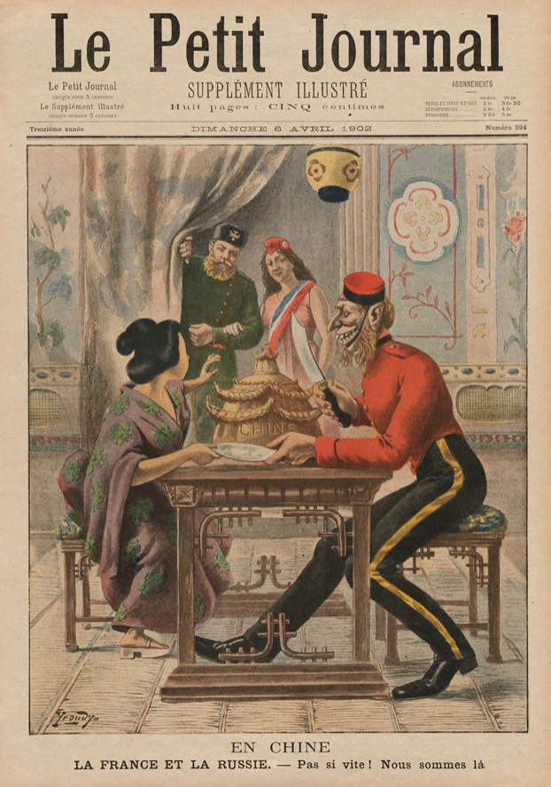

### Keywords

### Points of discussion

### Readings
Note: compulsory readings have been marked in **bold**

* Best, Antony, and Oliviero Frattolillo, eds. 2016. *Japan and the Great War*. 1st ed. 2015 edition. New York, NY: Palgrave Macmillan.
* Chi, Madeleine. “Bureaucratic Capitalists in Operation: Ts'ao Ju-Lin and His New Communications Clique, 1916-1919.” *The Journal of Asian Studies 34*, no. 3 (May 1975): 675. doi:10.2307/2052549.
* Dickinson, Frederick R. 1999. *War and National Reinvention: Japan in the Great War, 1914-1919*. Harvard East Asian Monographs. Cambridge, Mass: Harvard University Asia Center.
* Langdon, Frank C. 1957. “Japan’s Failure to Establish Friendly Relations with China in 1917-1918.” *Pacific Historical Review* 26 (3): 245–58. doi:10.2307/3636215.
* Metzler, Mark. 2006. *Lever of Empire: The International Gold Standard and the Crisis of Liberalism in Prewar Japan.* Twentieth-Century Japan 17. Berkeley: University of California Press. Chapter 5: “Divine Providence,” 1914–1918
* **Schiltz, Michael. n.d. “Wartime and Post-War Economies (Japan) | International Encyclopedia of the First World War (WW1).” Accessed November 11, 2018. https://encyclopedia.1914-1918-online.net/article/wartime_and_post-war_economies_japan.**
* **Schiltz, Michael. 2012. *The Money Doctors from Japan: Finance, Imperialism, and the Building of the Yen Bloc, 1895-1937*. Harvard University Asia Center. Chapter 3: “Separating the Roots of the Chrysanthemum”: Nishihara Kamezo and the Abortive China Loans, 1917–1918.** (see [here](https://drive.google.com/file/d/0B3cHT3HtkF5kNTRJM25ua29QcjA/view?usp=sharing))

### Primary sources

* “社会科授業用資料リスト.” n.d. Accessed November 11, 2018. https://www.jacar.go.jp/siryolist/index.html.
* Inoue, Junnosuke, and Eric Henry De Bunsen. 1931. *Problems of the Japanese Exchange, 1914-1926*. London: Macmillan and Co. https://catalog.hathitrust.org/Record/006103638.

### Audiovisual materials

* “WW1: The Siege of Tsingtao.” n.d. BBC News. Accessed November 11, 2018. https://www.bbc.com/news/av/world-asia-china-29801553/ww1-the-siege-of-tsingtao.

### Links to other projects, websites, others

* *The Telegraph*. 2017. “Betrayed Ally: How China Was Snubbed after World War I,” March 21, 2017. https://www.telegraph.co.uk/news/world/china-watch/society/betrayed-ally-snubbed-after-world-war-i/.
* “Japan during World War I.” 2018. Wikipedia. https://en.wikipedia.org/w/index.php?title=Japan_during_World_War_I&oldid=868291760.

### to follow (@twitter)

