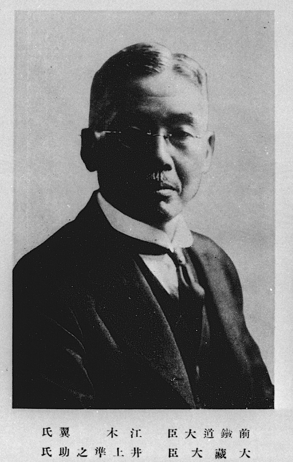

### Keywords

* `induced deflation`, `austerity`, `hard money`

### Points of discussion

* gold standard restoration fitted in a wider global trend towards so-called stabilization (e.g. price stabilization) and rationalization (合理化) and was described as a reaction to the inflationary wave that was fueled by the post-WWI reconstruction. Yet it was not the first, nor the last, induced depression in modern history: discuss. Remember that price stabilization and exchange-rate stabilization were/are different, yet complementary aspects of the deflationary mindset.
* try to pinpoint what constitutes the core idea and the primary problem of induced deflation (stabilizing/destabilizing). Why did high finance, in particular, have a stake in such policy? Were gains and losses equally distributed between creditors and debtors?

### Readings
Note: compulsory readings have been marked in **bold**

* Ahamed, Liaquat. 2009. *Lords of Finance: The Bankers Who Broke the World*. Reprint edition. New York: Penguin Books.
* Eichengreen, Barry, and Marc Flandreau. 2009. “The Rise and Fall of the Dollar (or When Did the Dollar Replace Sterling as the Leading Reserve Currency?).” *European Review of Economic History* 13 (3): 377–411. https://doi.org/10.1017/S1361491609990153.
* **Metzler, Mark. 2006. *Lever of Empire: The International Gold Standard and the Crisis of Liberalism in Prewar Japan*. Twentieth-Century Japan 17. Berkeley: University of California Press.** Chapter 8: "The Theory and Practice of Induced Depression"
* **idem**. Chapter 11: "Opening the Door to a Hurricane, 1930–1931"

### Primary sources

* Keynes, John Maynard. 2010. “The Economic Consequences of Mr Churchill (1925).” In *Essays in Persuasion*, edited by John Maynard Keynes, 207–30. London: Palgrave Macmillan UK. https://doi.org/10.1007/978-1-349-59072-8_17.

### Audiovisual materials

* 日本の歴史的演説. n.d. 「井上準之助「危ない哉！国民経済」」. Accessed November 16, 2018. https://www.youtube.com/watch?v=pdaa-NIIrCM.
* Historia Mundi. n.d. 166　金解禁と昭和恐慌（教科書343）　日本史ストーリーノート第17話. Accessed November 21, 2018. https://www.youtube.com/watch?v=DV_bI7O_zhw.

### Links to other projects, websites, others

### to follow (@twitter)

