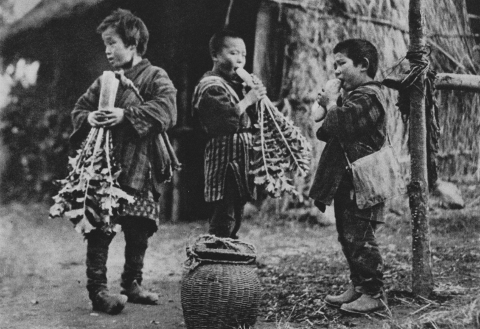

### Keywords

### Points of discussion

### Readings
Note: compulsory readings have been marked in **bold**

* Francks, Penelope. 2009. *The Japanese Consumer: An Alternative Economic History of Modern Japan*. Cambridge, UK ; New York: Cambridge University Press.
* **Krugman, Paul. 1998. “The Hangover Theory.” *Slate Magazine*. December 4, 1998. https://slate.com/business/1998/12/the-hangover-theory.html.**
* **———. 2010. “Hangover Theory At The Fed.” Paul Krugman Blog. August 24, 2010. https://krugman.blogs.nytimes.com/2010/08/24/hangover-theory-at-the-fed/.**
* **Thoma, Mark. n.d. “Economist’s View: ‘The Hangover Theory.’” Accessed December 6, 2018. https://economistsview.typepad.com/economistsview/2013/05/the-hangover-theory.html.**
* **Metzler, Mark. 2004. “Woman’s Place in Japan’s Great Depression: Reflections on the Moral Economy of Deflation.” *Journal of Japanese Studies* 30 (2): 315–52. https://www.jstor.org/stable/25064491.**

### Primary sources

### Audiovisual materials

* 0klz47. n.d. 緊縮小唄-A-(葭町 藤本二三吉). Accessed November 29, 2018a. https://www.youtube.com/watch?v=1H9Shdn7Ics.
* ———. n.d. 緊縮小唄-B-(河司春江). Accessed November 29, 2018b. https://www.youtube.com/watch?v=k9XOB7hBsLQ.

### Links to other projects, websites, others

### to follow (@twitter)

